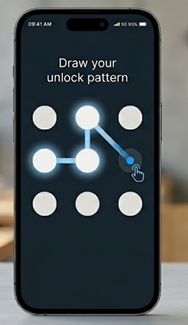

<div align="center">
  <h1>🔐 Flutter Unlock Pattern Screen</h1>
  <p>A sleek, interactive, and fully customizable 3x3 pattern lock screen built purely with Flutter Canvas primitives.</p>
</div>

<br/>

<div align="center">
  
</div>

<br/>

## ✨ Features

*   **🎨 Custom Canvas Rendering:** Uses `CustomPainter` to draw nodes and paths directly on the canvas, ensuring high performance without heavy external dependencies.
*   **🌟 Stunning Visuals:** Features dynamic glowing nodes with neon blue shadows, bright inner fills, and smooth connecting gradients.
*   **📐 Responsive Grid:** Fluid 3x3 matrix collision detection that scales dynamically and maintains sensitivity across different device form factors.
*   **⚡ Real-Time Tracking:** Smoothly renders paths that trace sequentially and point directly to the user's current touch location.
*   **🧩 Modular Architecture:** Code logic is neatly organized and decoupled into separate files for easy maintenance and scaling.

---

## 🛠️ Tech Stack

*   **Framework:** <span style="color:#02569B; font-weight:bold;">Flutter</span> (<span style="color:#0175C2; font-weight:bold;">Dart</span>)
*   **Core Primitives:** `CustomPainter`, `GestureDetector`, `Offset`, `Path`
*   **Design Paradigm:** Deep navy/charcoal canvas (`#121B22`) accented by neon blues (`#0288D1`, `#4FC3F7`).

---

## 📁 File Structure

The project code is clean and split logically inside the `lib/` directory:

1.  `main.dart` - Application entry point, applying the global Dark Theme.
2.  `unlock_pattern_screen.dart` - The core screen, maintaining UI layout, state logic, hit detection, and panning gestures.
3.  `pattern_painter.dart` - A specialized `CustomPainter` delegating the actual rendering of the dots, interactive glowing paths, and touch feedbacks.

---

## 🚀 Getting Started

Follow these instructions to run the application locally on your machine:

1.  **Clone the project / navigate to the folder:**
    ```bash
    cd unlock_pattern
    ```
2.  **Fetch dependencies:**
    ```bash
    flutter pub get
    ```
3.  **Run the application:**
    ```bash
    flutter run
    ```

---

<div align="center">
  <p><i>Crafted with ❤️ and <b>Flutter</b></i></p>
</div>
